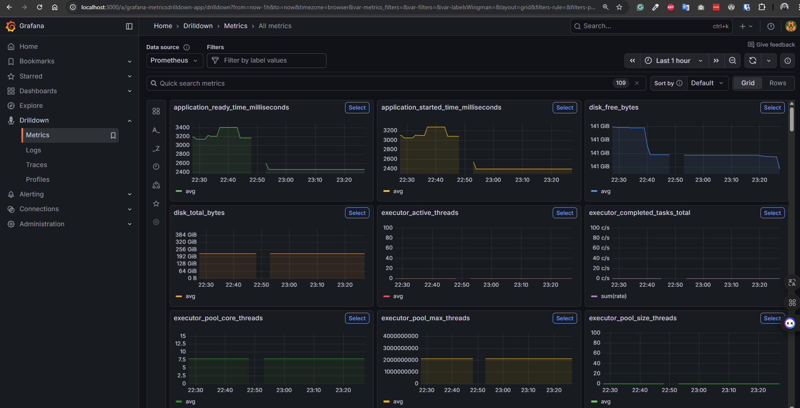
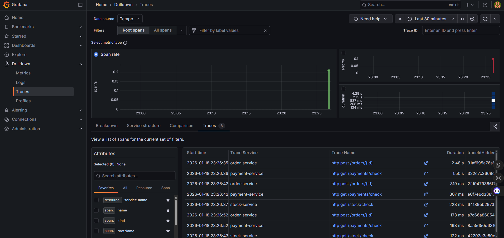

# Distributed Tracing POC: Spring Boot 4 & Grafana LGTM Stack

This Proof of Concept (POC) demonstrates end-to-end distributed tracing across three Spring Boot 4 microservices. The observability stack (Loki, Grafana, Tempo, Mimir) is deployed on Kubernetes, while the services run locally using native Spring Boot OpenTelemetry support.

## 1. Architecture Overview

The POC simulates an **Order -> Payment -> Stock** workflow to demonstrate context propagation:

| Service | Description | Port |
|---------|-------------|------|
| **order-service** | Entry point | 8080 |
| **payment-service** | Intermediate payment logic | 8081 |
| **stock-service** | Final stock validation | 8082 |

> **Note:** The stock-service triggers a `RuntimeException` for order ID `999` to showcase error capturing.

## 2. Infrastructure Setup (Kubernetes)

Deploy the LGTM stack (Loki, Grafana, Tempo, Mimir) to your Kubernetes cluster using the official Grafana Docker OTEL LGTM repository:

> **Reference:** [https://github.com/grafana/docker-otel-lgtm](https://github.com/grafana/docker-otel-lgtm#run-lgtm-in-kubernetes)

Expose the OTLP receivers:

```bash
# Apply Kubernetes resources from the official Grafana LGTM repo
kubectl apply -f k8s/lgtm.yaml

# Forward ports so local Spring Boot apps can reach the K8s services
kubectl port-forward service/lgtm 3000:3000 4040:4040 4317:4317 4318:4318 9090:9090
```

## 3. Local Service Configuration

Each service is configured via `application.properties` to export telemetry data to the OTLP endpoint:

```properties
spring.application.name=order-service

management.tracing.sampling.probability=1.0
management.otlp.metrics.export.url=http://localhost:4318/v1/metrics
management.opentelemetry.tracing.export.otlp.endpoint=http://localhost:4318/v1/traces
management.opentelemetry.logging.export.otlp.endpoint=http://localhost:4318/v1/logs
```

## 4. Running the Services

Navigate to each service directory and start with Maven:

```bash
# Terminal 1 - Order Service
cd order-service
mvn spring-boot:run

# Terminal 2 - Payment Service
cd payment-service
mvn spring-boot:run

# Terminal 3 - Stock Service
cd stock-service
mvn spring-boot:run
```

## 5. Testing & Visualization

### Triggering a Trace

Generate a request that traverses all three services:

```bash
curl -X POST http://localhost:8080/orders/123
```

### Triggering a Failure

Simulate a stock error to see the point of failure:

```bash
curl -X POST http://localhost:8080/orders/999
```

### Viewing Results in Grafana

Access Grafana at [http://localhost:3000](http://localhost:3000) (User: `admin` / Pass: `admin`).

Navigate to **Explore** and select the appropriate datasource.

## 6. Screenshots

### Logs (Loki)


### Metrics (Mimir)



### Traces (Tempo)


